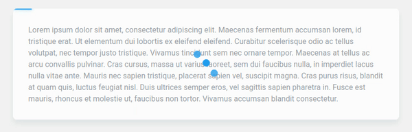

# react-fetcher-hooks

> 

[](https://www.npmjs.com/package/react-fetcher-hooks) [](https://standardjs.com)



# Why?
The goal of this library is to take away the pain of manually handling fetching states (idle, loading, error)
for every one of your components. Just hand over an HTTP request to Fetcher and let it handle the
visual feedbacks and the what-ifs.  
It reduces boilerplate but also give you a wide range of customization tools for general usage.

# Installation

## Using yarn
```bash
yarn add react-fetcher-hooks
```

## Using npm
```bash
npm install react-fetcher-hooks
```

# Usage

`react-fetcher-hooks` exposes `useFetcher` and a component that automatically handle the visual feedback
when fetching data. For now, the library accepts an `AxiosPromise` primarily but you can handle any
other type of promise. This is further explained in the docs.
```jsx
import React, { useEffect } from 'react';
import { useFetcher, Fetcher } from 'react-fetcher-hooks';
import axios from 'axios';

const MyComponent = () => {
  const fetcher = useFetcher();
  useEffect(() => {
    let request = () => axios.get('...');
    fetcher.fetch(request, data => {
      // Do something with data
    });
  }, []);

  return (
    <div>
      <Fetcher fetcher={fetcher}>
        My content
      </Fetcher>
    </div>
  );
}
```  
There's no need for handling errors on this level. If any happens,
the callback just won't be called and the visual feedback will be handled automatically.

# Docs
https://cyriacbr.github.io/react-use-fetcher/